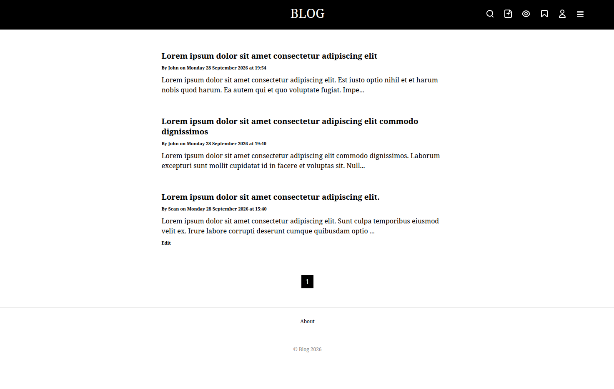

# Blog

A social blogging app

## Setup

Clone the repository, run `composer install`, set up the database using `blog.sql` and set DB credentials in `config.php`. Run the app using PHP's local development server: `php -S localhost:8080 -t public`